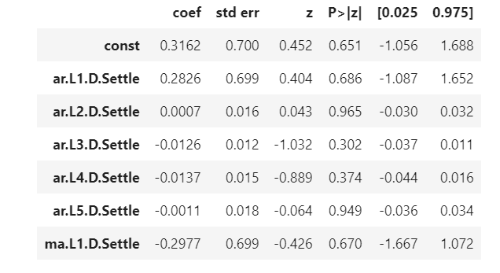

# Unit10_ts_homework
## Time-Series Forecasting Using ARMA Model

- After running an ARMA (2,1) model, the forecasted next 5-day returns for Yen futures are: 1.23%, 0.54%, 0.66%, 0.63%, and 0.64%

- Based on the p-value, however, the model doesn't seem to be a good fit since all p-values for different lags are larger than 0.05; as it shows in the following summary:

----
## ARIMA Model
- An ARIMA (5,1,1) model is used based on the raw yen futures settle price (instead of percentage change). The forecasted yen futures settle price for the next 5-day are: $9224.01, $9225.50, $9226.58, $9227.67, $9228.21

-Based on the p-value, however, the arima model still doesn't seem to be a good fit, as the p-values shown below are all above 0.05:

----
## GARCH Model
- Based on a garch (2,1) model, the volatilities (i.e standard deviation) for the next 5 days are: 7.43	7.48	7.52	7.56	7.60

-The garch model seems to be a good fit since p-values of both alpha and beta are smaller than 0.05:

----
- As a conclusion, based on both ARMA and ARIMA models, the yen is expected to increase in the next 5 days, so I'd buy the yen now. The risk, forecasted by the GARCH model, is also expected to increase sharply in the next 5 days. However,I'd not feel condifent using these models bucause the p-values are way larger than 0.05 threshold. 
----
## Linear Regression Forecasting
- A linear regression model is used to predict Yen futures returns comparing to the actual returns. The following graph shows the model's prediction was actually very close to the actual return: 

- The RMSE for Out-of-Sample (0.41521675083603804) is slighly lower than In-sample RMSE (0.5658708047560468), which indicates that out-sample performance is actually better then in-sample performance as it's more close to 0; since smaller number indicates higher accuracy